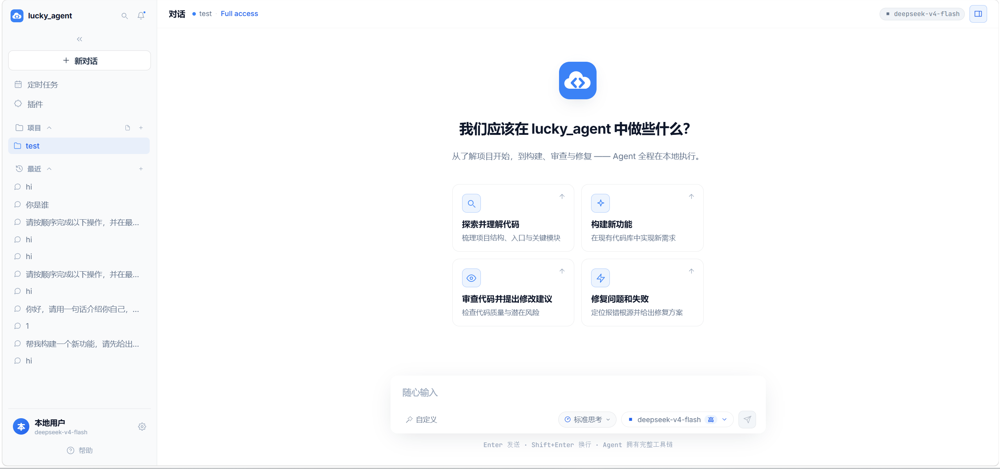
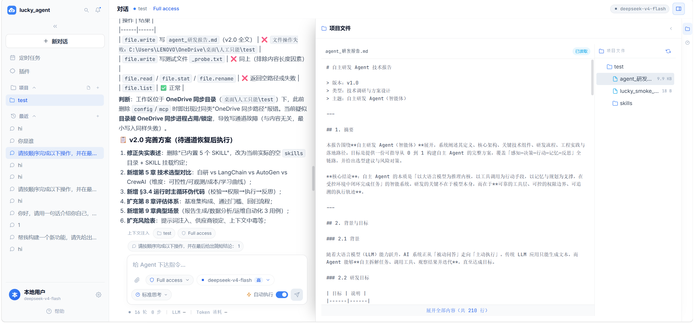
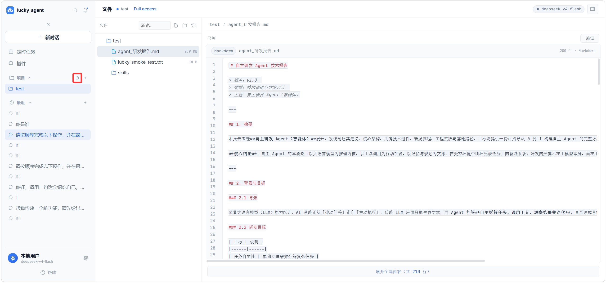
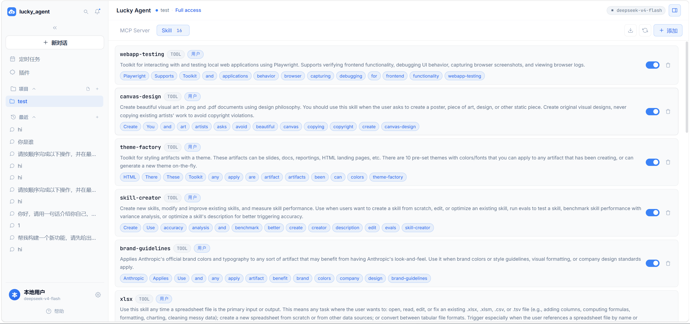
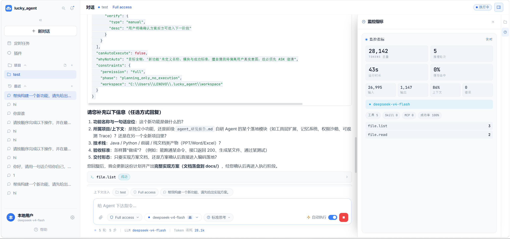
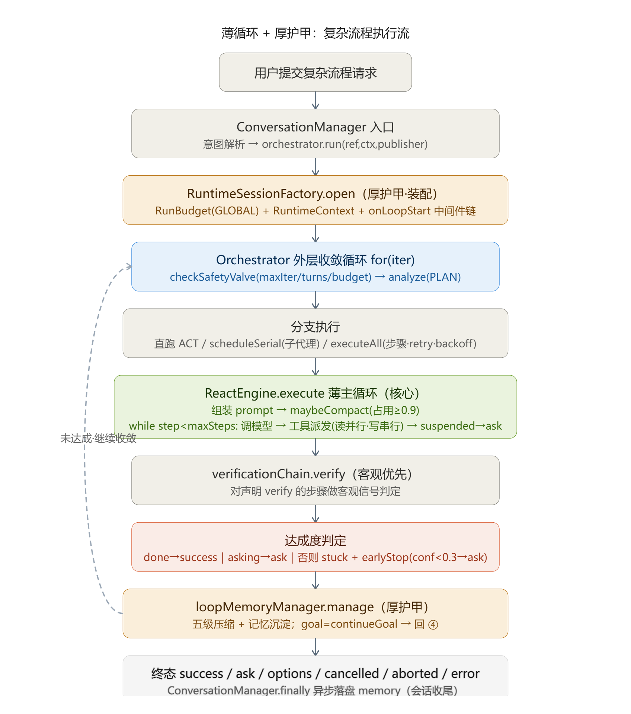

# Lucky Agent

**本地优先的单 Agent / 多 Agent 智能体编排框架**

Lucky Agent 是一个运行在**用户本机**的 Agent 框架：它只负责 Agent 的**编排、推理与执行链路**（支持单 Agent 与多 Agent / 隔离子代理任务），不托管模型、不存储用户信息、不对用户数据做任何服务端管理。

- 用户数据始终留在本机工作空间，平台不接触、不存储、不回传。
- 突出 **Java 的稳定与工程严谨**，融合 **Agent 的创作性**

---

## ✨ 特性

- **本机优先（零托管）**：会话、记忆、文件、配置全部存放于本机 `~/.lucky_agent`，天然不接触用户内容。
- **REACT 主回环编排**：分析 → 拆分步骤/子代理 → 执行 → 客观验证 → 达成度判定 → 记忆管理 → 再分析，全程安全阀（最大迭代/回合/token）兜底。
- **多 Agent 子代理（按需启用）**：极高复杂任务可在 PLAN 阶段声明 `subagents`，框架启动**隔离子代理**（独立会话上下文、工具白名单、受限预算、只回摘要），结果回灌主链路继续推进进度；默认单 Agent，开关 `core.subagent-enabled` 开启。
- **客观验证链**：步骤可声明 `verify`（文件存在/内容断言、构建/测试/命令退出码），以客观信号为准，不依赖模型自述。
- **硬性权限边界**：执行臂强制权限级别（只读/修改/全部）+ `deny > ask > allow` 规则链；高危操作先 ASK 确认，重启可恢复。
- **记忆系统（Claude Code 式分层 + 双轨）**：md 轨按「用户级 + 本地级（工作空间）」维护精炼记忆与索引（`MEMORY.md`，四类分类 user/feedback/project/reference），JSONL 轨按工作空间分组保留原始事实带；每一轮会话收尾异步 LLM 增量合并，`Dream` 定时合成（合并/去重/修剪，矛盾以时间近者优先）；记忆预取选择器每轮按目标挑出最相关条目注入，同会话去重；`memory.search/read` 只读工具按需查阅。
- **五级上下文压缩**：上下文接近阈值自动触发 `FiveLevelCompactionPipeline`——工具结果裁剪（Microcompact）→ 滑动窗口（Snip）→ 摘要下沉（Reactive），全程由 `PreservedSegment` 保全系统提示/最近 N 轮/关键结果，连续失败由熔断器（TokenCircuitBreaker）兜底；压缩前的执行结论再沉淀为长期记忆，支撑主回环多轮自纠。
- **工具与 Skill**：文件/Shell/Skill/MCP 统一网关；Skill 按需注入（渐进披露），按扩展名自动判语言。
- **提示词分层**：基座（`LUCKY.md`，可改即生效）+ 人格 + 阶段指令 + 权限约束 + 记忆召回，静态/动态分界。

---

## 📁 目录结构

```
lucky_agent/
├── lucky / lucky.bat / lucky.sh   # 一键启动脚本（Windows / bash）
├── LICENSE
└── web/
    ├── app/                       # 后端（Maven 多模块，Java 21 + Spring Boot 3）
    │   ├── agent-web/             # 入口：REST + SSE 事件流，托管前端
    │   ├── agent-core/            # 编排中枢：REACT 引擎、主循环、运行时(runtime: 中间件/工具/策略/验证/预算)、子代理、压缩
    │   ├── agent-model/           # 模型端点接入（OpenAI/Anthropic 兼容）、提示词、基座外置
    │   ├── agent-common/          # 公共 DTO/常量/契约
    │   ├── agent-workspace/       # 工作空间配置（唯一 owner）
    │   ├── agent-permission/      # 权限规则/审计/危险操作识别
    │   ├── agent-executor/        # 文件服务/执行臂接入
    │   ├── agent-memory/          # 记忆读写与召回（md 分层 + JSONL 事实带）
    │   ├── agent-skill/           # Skill 注册与注入
    │   ├── agent-persona/         # 人格/角色
    │   ├── agent-mcp/             # MCP 工具接入
    │   ├── agent-workflow/        # 独立工作流模块：定义/DAG 编译(拓扑+环检测)/调度执行 + REST/SSE
    │   ├── agent-cache/           # 缓存
    │   └── agent-cli/             # CLI 外壳（后续）
    └── fronted/                   # 前端（Vue 3 + TypeScript + Vite + Pinia + Vue Router）
    # 各模块内部统一分层：api(契约) / service(.impl) / repository / support(领域执行) / config / util
```

运行期数据位于 `~/.lucky_agent/`（框架必备目录）：

| 目录                   | 作用                                                                                       |
|----------------------|------------------------------------------------------------------------------------------|
| `LUCKY.md`           | **基座提示词**，改完保存即时生效                                                                       |
| `settings.json`      | 全局设置（模型端点 + 推理深度；**API Key 已 AES-GCM 加密落盘**）                                             |
| `config/`            | 账号 / 工作空间注册表 / 加密密钥 / Skill 状态                                                           |
| `memory/`            | 记忆：`md/`（用户级 + `<工作空间全路径>/` 本地级分层条目与 MEMORY.md 索引）+ `{userId}/{工作空间}_ws/mem.jsonl` 原始事实带 |
| `skills/`            | 全局（平台级）Skill 库                                                                           |
| `agent/sessions/`    | 会话历史（JSONL + 元数据）                                                                        |
| `logs/audit.jsonl`   | 操作审计日志                                                                                   |
| `rollback/` `trash/` | 回滚快照 / 回收站                                                                               |
| `workspace/`         | 内置默认工作空间（用户产物）                                                                           |

---

## 🧱 技术栈

| 层 | 选型 |
|----|------|
| 语言 / 框架 | Java 21+ · Spring Boot 3.x · Maven 多模块 |
| AI 编排核心 | LangChain4j（Agent/工具/记忆/RAG）+ LangGraph4j（工作流/多 Agent 图，可选模式） |
| 辅助接入 | Spring AI（模型/嵌入/向量/可观测性桥接） |
| 前端 | Vue 3 · TypeScript · Vite · Pinia · Vue Router |

---

## 🚀 快速开始

### 前置依赖
- **Java 21+**
- **Maven 3.9+**（一键脚本首启时自动构建后端）
- **Node.js 18+ / npm**（一键脚本首启时自动构建前端）
- 一个 OpenAI / Anthropic 兼容的模型端点与 API Key（自备）

### Windows
```bat
lucky.bat
```
### macOS / Linux
```bash
./lucky.sh
```

首次运行会自动：`mvn package` 构建后端 → `npm ci && npm run build` 构建前端 → 启动服务。

浏览器访问 **http://127.0.0.1:8080**（默认监听本机；可用 `LUCKY_HOST` / `LUCKY_PORT` 覆盖端口）。

### 首次配置
1. 启动后在界面「设置」中添加模型端点（`endpointUrl` + `apiKey` + `modelName`），并选择推理深度。
2. 基座提示词可直接编辑 `~/.lucky_agent/LUCKY.md`，保存即生效。
3. 如需隔离子代理，将后端 `application.yml` 的 `core.subagent-enabled` 设为 `true`。

---

## 🔧 开发

### 后端
```bash
cd web/app
mvn compile                 # 编译
mvn test                    # 运行单测
mvn -pl agent-web -am package -DskipTests   # 打包
```
核心配置：`web/app/agent-web/src/main/resources/application.yml`
- `core.orchestrator-mode`: `reactor`（默认）/ `langgraph`
- `core.subagent-enabled`: 是否启用隔离子代理
- `model.context-threshold`: 上下文压缩阈值

### 前端
```bash
cd web/fronted
npm ci
npm run dev      # 开发服务器（代理后端 /api）
npm run build    # 生产构建（产物 dist 不入库）
```

### 运行测试
```bash
cd web/app && mvn -o test
```

---

## 🧭 使用说明

- **对话/Agent 执行**：直接在聊天框描述目标；简单问题即时回答，复杂任务自动规划。
- **拆解方式（B 节点决策）**：普通拆分→`steps`（同一 Agent 分步执行）；高复杂度独立子问题→`subagents`（隔离子代理，需开启开关）。
- **文件**：文件页可浏览目录、语法高亮预览、行内编辑与保存。
- **高危操作**：删除/执行等会触发确认，可在设置调整权限级别。

---

## 🖼️ 界面预览











---

## ⚙️ 配置速查

| 配置 | 位置 | 说明 |
|------|------|------|
| 模型端点 / 推理深度 | `~/.lucky_agent/settings.json` | 主/备/记忆端点 + 全局推理深度（Key 加密落盘） |
| 基座提示词 | `~/.lucky_agent/LUCKY.md` | system prompt 第一层，保存即生效 |
| 人格 | `~/.lucky_agent/config/persona.json` | 角色 / 语气 / 行为参数 |
| 权限规则 | `~/.lucky_agent/config/` | deny > ask > allow 规则链 |
| 记忆 | `application.yml` 的 `memory.md.*` | 预取开关/TopK/索引上限/Dream 周期与阈值 |

> API Key 存于用户本机 `settings.json`，已按 D8 以 AES-GCM 加密落盘（明文不写盘）；请勿将密钥文件提交到版本库。

---

## 🗺️ Agent 主链路

```text
输入 → LLM 分析(B)
        ├─ 拆成步骤？ ─否→ 单 Agent 直接执行 → 客观验证
        ├─ 拆成步骤？ ─是→ 逐步骤执行（失败重试/超限终止）
        └─ 启动隔离子代理？─是→ TaskScheduler 隔离执行 → 摘要回灌
→ 客观验证(D) → 达成度判定(I)
        ├─ 达成 → 总结输出
        └─ 未达成(未超上限) → 记忆管理(K: 压缩+沉淀) → 回 B 再分析
安全阀(N): 最大迭代/回合/token → 强制结束并总结
```

### 核心执行流程图（薄循环 + 厚护甲）

给定一个复杂流程时，Agent 从入口到终态的完整执行流如下：`ConversationManager` 入口 → `RuntimeSessionFactory.open` 装配厚护甲（四级预算 + 运行时上下文 + 中间件链）→ `Orchestrator` 外层收敛循环（安全阀 + PLAN）→ 按规划分支执行（直跑 ACT / 隔离子代理 / 步骤级 retry·backoff）→ 每步进入 `ReactEngine` 薄主循环（调模型 → 工具派发，读并行写串行）→ 客观验证 → 达成度判定 → 未达成则五级压缩 + 记忆沉淀后带 `continueGoal` 回环，直到达成或安全阀强制收束。



### 薄主循环 + 厚运行时（`core.orchestrator-mode=thin`）

在保留上述主回环语义的前提下，提供「薄主循环」模式：主循环只保留三步 —— **调 LLM → 执行工具/子代理 → 回填观察**；拆解、调度、验证、记忆、预算、安全阀全部下沉到可插拔运行时（`com.lucky.agent.core.runtime`）：

| 运行时组件                       | 职责与具体实现                                                               |
|-----------------------------|-----------------------------------------------------------------------|
| `ExecutionResult`           | 所有执行路径（单 Agent/步骤/子代理/工具/验证）统一结果契约（状态/输出/产物/错误/指标/trace/元数据）          |
| `AgentRuntime`              | 厚运行时门面：中间件链 + 工具注册表 + 策略插件 + 验证器 + 记忆端口 + 子代理池                        |
| `Middleware`（`order()` 可排序） | 横切关注点，含**环绕钩子** `aroundTool`（重试类能力必须包裹真实调用）：权限 `-400` → 预算 `-100` → 重试 `500` → 压缩 `600` → 召回 `700` → 快照 `900` → 日志 `1000` |
| `RuntimeTool`（LLM 可调用）      | `decompose` 拆解、`spawn_sub_agent` 子代理、`verify` 校验、`memory` 压缩/沉淀；工具只**声明**所需权限级别，由权限中间件裁决 |
| `StrategyPlugin`            | `DefaultStrategyPlugin`：保守启发式（≥2 信号才拆解、拆出 ≥2 步且含并行意图才派子代理），拆解幂等、子代理不再派生孙代理 |
| `Verifier`（客观优先）            | `CompositeVerifier` 链：`ChainVerifierAdapter` 桥接既有 `VerificationChain`（File/Command 客观校验经 `FileService`，受权限与执行臂边界约束）+ `LlmJudgeVerifier` 结构化判定；另含轻量 `FileArtifactVerifier`/`ExternalCommandVerifier` |
| `MemoryPort`                | `SpringMemoryPort` 桥接既有分层 Markdown 记忆；成功才沉淀，失败只压缩（保留 goal/constraints/attempts/openQuestions/toolUsage） |
| `BudgetManager`             | 全局/任务/步骤/子代理 四级预算，各自独立超时/重试/token 限制                                  |
| `SubAgentPool`              | Java 21 虚拟线程 + 信号量背压 + 深度/单轮数量硬约束；子代理独立 messages/budget/trace           |
| `LoopController`            | 达成度判定 / 卡死守卫（连续两轮结论一致即停）/ 记忆沉淀与压缩 / 早停转 ASK —— 使主循环无分支      |
| `RuntimeSessionFactory`     | 统一引导（预算 + `RuntimeContext` + `MiddlewareContext` + 生命周期钩子），**thin 与 langgraph 共用**，消除双主循环引导漂移 |
| `ModelGateway`              | 模型调用韧性装饰链 `CircuitBreaker( Retry( Engine ) )`：指数退避 + 抖动（仅重试瞬时故障，401/参数错误不重试）、三态熔断（OPEN 时连带短路重试） |

主循环体只剩三步，**不含任何拆解、验证、记忆、安全阀的分支判断**（原 `Orchestrator.run()` 240 行 → `ThinAgentLoop.run()` 64 行，↓ 73%）。完整方案见 [`resources/主循环重构方案.md`](./resources/主循环重构方案.md)。默认 `reactor` 主环保持不变，切换 `core.orchestrator-mode: thin` 启用（strangler 迁移，可随时回滚）。

`reactor` / `langgraph` / `thin` 三个主循环**共用同一套运行时**（同一份验证链、记忆策略、早停语义、四级预算与模型网关），因此不存在「三份实现各自漂移」的问题。

### 验收指标（可复现）

`mvn -pl agent-core -Dtest='RuntimeAcceptanceTest,ModelGatewayTest' test` 可无成本复现下列量化指标：

| 指标 | 目标 | 实测 |
|---|---|---|
| 主循环瘦身 | ≤ 120 行（↓ ≥ 50%） | **64 行（↓ 73%）** |
| 客观验证覆盖率 | ≥ 70% | 整体 **80%**（含 2 个天然无法客观校验的语料）；**可客观校验任务中 100%** 走客观路径 |
| token 消耗 | ↓ ≥ 20% | **↓ 60%**（同场景 5 轮 → 2 轮） |
| 四级预算 | 各级可独立熔断 | **4 级独立触发**，且全局耗尽能把循环挡在下一次模型调用之前 |
| traceId 贯通率 | ≥ 95% | **100%**，每轮 before/after-llm 快照可回放 |

---

## 🧠 上下文压缩与记忆

上下文压缩（短期记忆）与长期记忆沉淀协作支撑主回环的多轮自纠，避免「未达成 → 再分析」时上下文只增不减。

### 五级上下文压缩（`FiveLevelCompactionPipeline`）
当会话消息占用接近上下文阈值（`model.context-threshold`，默认 0.9）自动触发，按序执行：

| 级别 | 策略 | 作用 |
|------|------|------|
| ① 裁剪 | `MicrocompactStrategy` | 截断过大的工具结果文本（`…（工具结果已裁剪）`） |
| ② 滑动窗口 | `SnipStrategy` | 丢弃最旧的「过程类」消息，保留 system 与最近 N 轮 |
| ③ 摘要下沉 | `ReactiveCompactStrategy` | 把旧工具结果/中间思考摘要为单行，保留关键前缀 |
| 保全 | `PreservedSegment` | 全程确保系统提示/最近 N 轮/关键结果不下沉，压缩后校验补回 |
| 熔断 | `TokenCircuitBreaker` | 压缩连续失败即熔断，兜底返回原消息，不无限重试 |

压缩前后触发 `PRE_COMPACT` / `POST_COMPACT` Hook（deny-wins 可阻断），并向界面推送压缩进度；压缩产物回写会话状态，避免每轮重复压缩。

### 长期记忆（Claude Code 式分层 Hint 型 + 做梦）

**写入（生成）**：每轮会话收尾异步执行「会话总结 → 项目合并 → 整体合并」三级 LLM 增量合并，条目按 `- [user|feedback|project|reference]` 四类分类、矛盾以时间近者优先；合并产物写入 `~/.lucky_agent/memory/md/`（用户级）与 `memory/md/<工作空间全路径>/`（本地级），并同步生成 `MEMORY.md` 索引（行/字节上限，超限由 Dream 修剪）。

**召回（注入）**：两级 `MEMORY.md` 索引轻量全量注入 System Prompt；**预取选择器**按本轮目标从索引挑出 ≤TopK 最相关条目取全文注入（会话内去重，`memory.prefetch.*` 可配/可关）；需要时可用 `memory.search` / `memory.read` 只读工具主动查阅。

**沉淀（Dream 合成）**：默认每 24 小时 + 累计新会话数阈值触发（单实例锁，启动延迟避免启动风暴），对新增会话总结做「定向 → 收集 → 合并 → 修剪」，定期把碎片化记忆整理为精炼条目；JSONL 原始事实带（按 `{userId}/{工作空间}_ws/` 分组）一并做衰减/遗忘/容量裁剪（做梦清理，默认 6h 周期）。

---

## 📌 当前边界

- 当前以 **Web 端 Agent** 为主交互；CLI Agent 后续阶段接入（复用同一内核/配置/记忆）。
- `langgraph` 编排模式与 `reactor` 语义等价；`thin` 为薄主循环模式。三者**共用同一套运行时**（验证链、记忆策略、早停语义、四级预算、模型网关），默认 `reactor`。
- 新增 `thin`（薄主循环 + 厚运行时）编排模式：主循环仅三步，拆解/验证/记忆/预算外置为运行时组件；默认关闭，`core.orchestrator-mode: thin` 启用。
- 模型调用侧韧性（指数退避 + 抖动 + 三态熔断）经 `ModelGateway` 统一提供，`reactor` 的 ACT 调度、`langgraph`、`thin` 三处均生效。
- 记忆写入型工具（`memory.save` 等）默认不开放，仅框架自动生成 + `memory.search/read` 只读查阅；外部知识图谱/向量检索在后续阶段接入。
- 客观验证默认开启（`core.verification-enabled`）。
- API Key 已加密落盘（D8），密钥文件为本机私有、不入库。

---

## 📄 License

本项目基于 [LICENSE](./LICENSE)。
